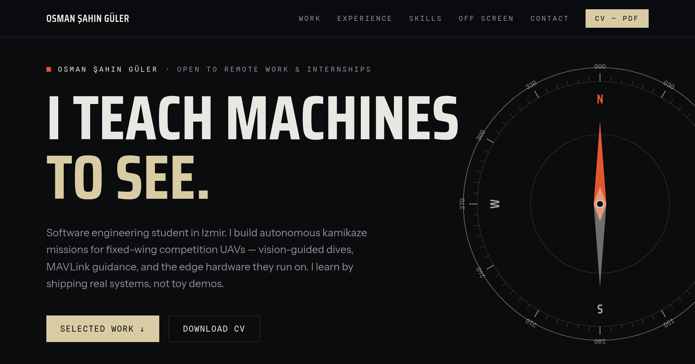

# osmansahinguler.com

Personal portfolio of **Osman Şahin Güler** — software engineering student working on
computer vision and autonomous UAVs.

**Live:** [osmansahinguler.com](https://osmansahinguler.com)



## Design

A wind-and-compass identity, built from scratch — no template.

| Token | Value | Role |
|---|---|---|
| Ink | `#0B0C0E` | Background |
| Panel | `#131418` | Raised surfaces |
| Paper | `#E9E7E2` | Body text |
| Buff | `#D9CBA3` | Display accents |
| Signal | `#E4572E` | Orange accent — regatta buoys, annotation tools |

- **Type:** [Saira Condensed](https://fonts.google.com/specimen/Saira+Condensed) (display) ·
  [Instrument Sans](https://fonts.google.com/specimen/Instrument+Sans) (body) ·
  [Spline Sans Mono](https://fonts.google.com/specimen/Spline+Sans+Mono) (labels & data)
- **Signature element:** a hairline SVG compass rose in the hero. The needle swings and settles
  on load, then tracks the cursor — a per-frame lerp on a GPU-composited layer
  (`src/components/Compass.jsx`), disabled for touch devices and `prefers-reduced-motion`.
- **Motion:** scroll-reveals via a small `IntersectionObserver` hook; animated wind streaks in
  the "Off screen" section. Everything respects reduced-motion.

## Stack

- [React 18](https://react.dev) + [Vite](https://vite.dev)
- [Tailwind CSS](https://tailwindcss.com) with the design tokens above (`tailwind.config.js`)
- [EmailJS](https://www.emailjs.com) for the contact form — no backend
- Zero heavy runtime dependencies: no 3D, no animation libraries. **~54 KB gzipped.**

## Structure

```
src/
├── components/     Compass (hero signature), Reveal (scroll-in), Alert (form feedback)
├── sections/       Navbar · Hero · Work · Experience · Skills · Offscreen · Contact · Footer
├── constants/      All site content (projects, experience, skills, links) in one file
└── hooks/          useInView, useAlert
```

All copy lives in `src/constants/index.js` — edit content there without touching components.

## Development

```bash
npm install
npm run dev        # http://localhost:5173
npm run build      # production build to dist/
npm run preview    # serve the production build locally
```

### Environment variables

The contact form needs three EmailJS keys — see `.env.example`. Copy it to `.env.local`
for local dev. Without them the form degrades gracefully (shows the direct email address).

## Deployment

Pushes to `main` deploy automatically via [Vercel](https://vercel.com) — build command
`npm run build`, output `dist/`. Environment variables are set in the Vercel project settings.

## License

Code is [MIT licensed](LICENSE). The content — text, CV, images, and personal branding —
is © Osman Şahin Güler and not covered by the license.
